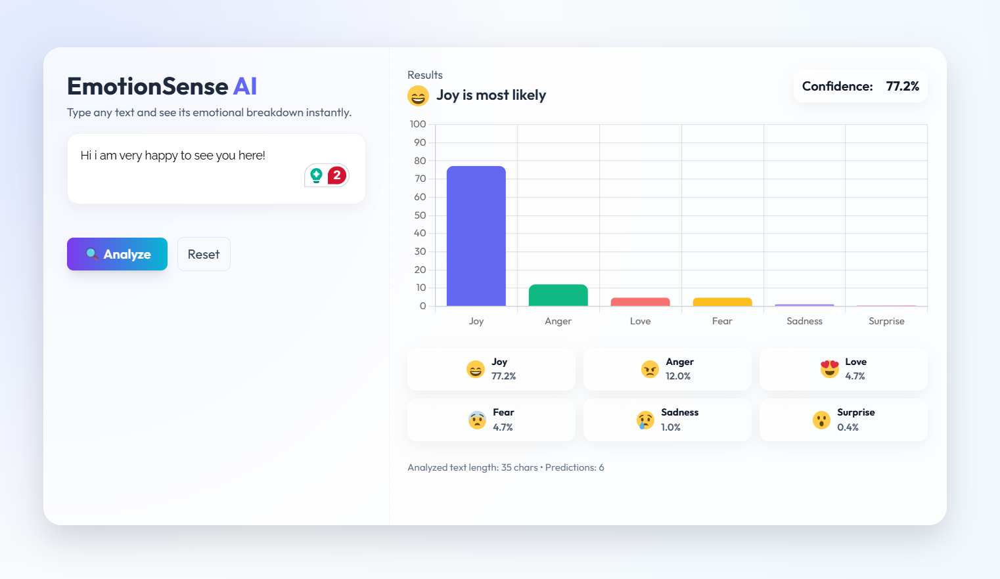

# 🎭 Emotion Detection — Django + Deep Learning

A full-stack web application that detects emotions from short text using a deep learning model (TensorFlow/Keras) and serves predictions via a Django web app.

### Preview



---


## 📋 Quick Contents

- ✅ Requirements & Software
- ⚙️ Setup (commands in order)
- 🏃‍♂️ Train & Run (exact commands)
- 🧾 Model summary (architecture & hyperparameters)
- 🔁 Saved artifacts (what the training produces)
- 🧩 How inference works (example code to load & predict)
- ✅ Benefits (realistic)


---

## ✅ Requirements & Software

Make sure you have the following installed:

- Python 3.9+ (3.10 recommended)

Python packages are listed in `requirements.txt`. Typical packages used by the project include:

- `tensorflow` (TF 2.x / Keras 3-compatible)
- `pandas`
- `numpy`
- `scikit-learn`
- `django` (Django 4.x or 5.x depending on your settings)

---

## ⚙️ Setup — Commands (run in this order)

Open a terminal at your project root (the folder that contains `manage.py`) and run the commands below.

### 1) Clone the repository

```powershell
git clone https://github.com/Ravi-Kiran-Usurupati/emotion-detection.git
cd emotion-detection
```

### 2) Create & activate a virtual environment

Windows (cmd):

```cmd
python -m venv venv
venv\Scripts\activate.bat
```

macOS / Linux:

```bash
python3 -m venv venv
source venv/bin/activate
```

### 3) Install dependencies

```bash
pip install -r requirements.txt
```

### 4) (Optional) Authenticate with Kaggle

Follow interactive instructions. If you prefer not to use Kaggle, download the dataset manually from https://www.kaggle.com/datasets/praveengovi/emotions-dataset-for-nlp and place `train.txt`, `val.txt`, and `test.txt` in the project root. The expected file format is: `text;emotion` (one example per line) .


## 🏋️ Train the model — exact command

Run the training script which:

- Loads or downloads the dataset,
- Builds a TextVectorization pipeline,
- Optionally downloads GloVe and initializes embeddings,
- Trains a Bidirectional LSTM model,
- Saves `emotion_model.keras` (single-file Keras archive) and a legacy `.h5` checkpoint,
- Saves `label_encoder.pkl`, `vectorizer_vocab.pkl`, and `history.json`.

Run training with:

```bash
python train_model.py
```

Important notes while training:

- GloVe download is large (~800MB). If you don't want this, set `USE_GLOVE = False` in `train_model.py`.
- The script looks for `train.txt`, `val.txt`, `test.txt` in the project root (format: `text;emotion`). If absent it may try to download the dataset via Kaggle.

---

## ▶️ Run the Django web app — exact commands

Run migrations and start the development server:

```bash
python manage.py migrate
python manage.py runserver
```

Open the UI in your browser:

```
http://127.0.0.1:8000/
```

Type text and click Analyze to get emotion probabilities.

---

## 🧠 Model summary (what's inside `train_model.py`)

High-level pipeline:

- Text preprocessing via `TextVectorization` (adapted on training texts) — integrated into the saved pipeline.
- Optional pretrained GloVe embeddings (if `USE_GLOVE=True`), otherwise embeddings are trained end-to-end.
- Embedding → Bidirectional LSTM → GlobalMaxPooling1D → BatchNorm → Dense(128) → Dropout(0.4) → Softmax output.

Key hyperparameters (defaults in the script):

- `VOCAB_SIZE` = 20000
- `MAX_LEN` = 120 tokens
- `EMBEDDING_DIM` = 100 (matches GloVe 100d if used)
- `BATCH_SIZE` = 64
- `EPOCHS` = 20
- `LR` = 1e-3
- `PATIENCE` = 4 (EarlyStopping patience)
- `Optimizer`: Adam
- `Loss`: sparse_categorical_crossentropy


Why this architecture?

- `TextVectorization` + `Embedding` capture vocabulary and sequence inputs.
- Bidirectional LSTM learns contextual sequence patterns.
- Global pooling reduces sequence dimension robustly and is fast at inference.
- Dense + Dropout prevents overfitting, BatchNorm stabilizes training.

---

## 💾 Training artifacts / saved files

After training you'll find files in `saved_model/`:

- `emotion_model.keras` — main inference artifact (single-file Keras archive containing the pipeline: TextVectorization + model). Use this to load and predict in your webapp.
- `emotion_model.h5` — legacy checkpoint (older checkpoint format if saved).
- `label_encoder.pkl` — `sklearn.preprocessing.LabelEncoder` mapping indices → emotion names.
- `vectorizer_vocab.pkl` — vocabulary extracted from the `TextVectorization` layer.
- `history.json` — training loss/accuracy history.

---

## 🧾 How inference works — example code

Below is a snippet you can use in Django or a standalone script to load the pipeline and run predictions. The saved Keras pipeline expects a batch of strings shaped either as a list[str] or as a numpy array shaped `(batch, 1)` depending on how it was saved — the example below uses `(batch, 1)`.

```python
import numpy as np
import pickle
import tensorflow as tf

MODEL_PATH = "saved_model/emotion_model.keras"
LABEL_ENCODER = "saved_model/label_encoder.pkl"

model = tf.keras.models.load_model(MODEL_PATH)

with open(LABEL_ENCODER, "rb") as f:
    le = pickle.load(f)

def predict_texts(texts):
    
    if isinstance(texts, str):
        texts = [texts]
    inp = np.array(texts, dtype=str).reshape(-1, 1)
    probs = model.predict(inp)             
    top_indices = probs.argmax(axis=1)
    labels = le.inverse_transform(top_indices)
    confidences = probs.max(axis=1)
    return labels.tolist(), confidences.tolist()

# Example
labels, conf = predict_texts("I am extremely happy today!")
print(labels, conf)
```

Note: The detector app's `views.py` includes an example compatible with this pipeline.

---

## 🔎 Realistic Benefits

- Immediate usability: An end-to-end system (training → saved pipeline → web UI) that’s ready to demo locally or deploy.
- Real-time inference: The saved pipeline includes preprocessing, so web requests send raw text and get probabilities in one call.
- Balanced training: Uses class weights to mitigate dataset imbalance and includes early stopping + LR scheduling.
- Lightweight deployment option: BiLSTM + pooling gives good accuracy while being relatively cheap to serve on CPU.
- Reproducible artifacts: Saves vocabulary, label encoder, and history for debugging and retraining.

---

## 🧑‍💻 Author

GitHub Link: https://github.com/Ravi-Kiran-Usurupati

---
